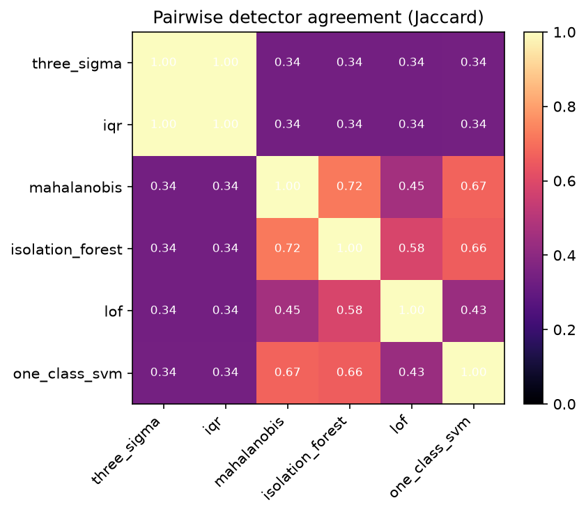
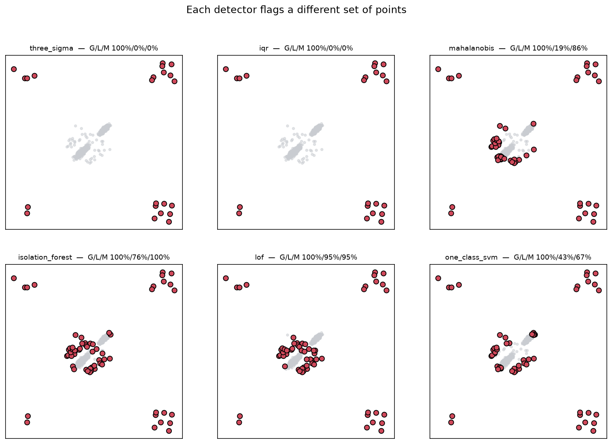
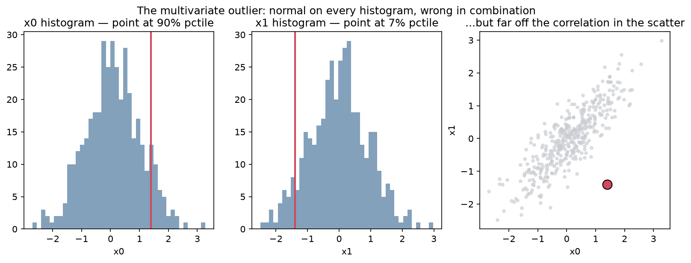

# outlier_arena

**Six outlier detectors walk into your dataset. They disagree on ~80% of it.**

A head-to-head comparison of six outlier-detection methods — the three-sigma rule, the IQR box-plot rule, Mahalanobis distance, Isolation Forest, Local Outlier Factor, and a one-class SVM — on synthetic datasets with **planted, known-type anomalies**. Because the ground truth is planted, every claim is *measured*, not asserted:

- the six detectors agree on only about **one in five** of the points they flag;
- the **three-sigma rule** every analyst reaches for is broken by both **masking** (its own inflated standard deviation moves the threshold out past the outlier that broke it) and **skew**;
- the right detector depends entirely on **what kind** of anomaly you are hunting — which nobody decides before running one.

Everything runs on a 2-CPU / 8 GB GitHub Codespace with no GPU.

---

## The headline, in three figures

**The detectors mostly disagree.** Among points flagged by *any* detector, only ~22% are flagged by all six.



**Each detector is looking for a different thing.** Univariate rules see only global outliers; Mahalanobis owns the multivariate one; LOF owns the local ones; Isolation Forest spreads its attention.



**The multivariate outlier is normal on every histogram and obviously wrong in the scatter** — the image that makes "you must look at combinations" undeniable.



---

## Quickstart

```bash
make setup       # install uv, sync deps, register the Jupyter kernel
make ci          # sync + lint + test  (what CI runs)
make notebooks   # execute all six notebooks headless (writes outputs/)
make run         # launch the Streamlit app on :8501
```

Requires Python ≥ 3.11 (the repo pins 3.12) and [`uv`](https://docs.astral.sh/uv/) — no `pip`. Run `make help` for every target.

---

## The six notebooks

Each notebook is a self-contained argument that imports from `src/`, runs in well under 5 minutes, is fully seeded, and writes its figures to `outputs/figures/*.png` and its numbers to `outputs/data/*.json`.

| # | Notebook | What it shows |
|---|----------|---------------|
| 01 | [Three-Sigma Is Broken](notebooks/01_three_sigma_is_broken.ipynb) | Masking (3σ flags **0%** of the extreme outliers, IQR **100%**) — a mathematical certainty, `z = √((n−m)/m)` — plus the skew failure: 3σ misses the short-side anomaly and swamps the long tail. |
| 02 | [Kinds of Outliers](notebooks/02_kinds_of_outliers.ipynb) | The taxonomy made visual: global, local and multivariate anomalies in one dataset, and the multivariate point that is unremarkable on both histograms. |
| 03 | [The Detector Zoo](notebooks/03_the_detector_zoo.ipynb) | All six detectors on the same data; the from-scratch Isolation Forest (Spearman ≈ 0.93 vs sklearn) and Mahalanobis (identical to `EmpiricalCovariance`) validated. |
| 04 | [The Arena](notebooks/04_arena.ipynb) | Precision-recall against planted truth (never accuracy), the agreement matrix landing near **20%**, and the disputed points. |
| 05 | [High Dimensions & Contamination](notebooks/05_high_dimensions_and_contamination.ipynb) | Distance concentration; dimensionality **helps when it carries signal, hurts when it is noise**; high contamination corrupts rarity-assuming detectors. |
| 06 | [Decision Framework](notebooks/06_decision_framework.ipynb) | The routing guide, plus the shipped `detect_outliers(X, method, contamination)` and `agreement_report(X)` utilities. |

---

## Which detector should I use?

Decide the **kind** of anomaly first; the choice is then almost made for you.

| If the anomaly is… | Use | Not |
|---|---|---|
| univariate, roughly symmetric | **IQR** or modified z-score | plain three-sigma |
| multivariate vs one correlated cloud | **Mahalanobis** | univariate rules |
| local, in varying-density regions | **LOF** | global rules |
| general tabular, mixed kinds | **Isolation Forest** (robust default) | — |
| high-dimensional | **Isolation Forest**; cut irrelevant features | distance methods |

And the meta-rules: run more than one detector and inspect the disagreements, and treat removing outliers as the modeling decision it is — not a reflex.

---

## Repository layout

```
src/
├── detectors/        statistical (3σ / IQR / modified-z), mahalanobis, isolation_forest, lof, one_class_svm
├── datasets/         synthetic planted-anomaly generator (global / local / multivariate)
├── evaluation/       agreement, detection (precision-recall), masking, comparison (the arena)
├── visualisation.py  shared plot helpers
└── artifacts.py      save every figure as PNG and every result as JSON
notebooks/            01–06, the narrative
app/streamlit_app.py  masking demo · anomaly sandbox · agreement viewer · dimension/contamination
tests/                the thesis, asserted (masking, from-scratch vs reference, per-type recall, agreement)
config/settings.yaml  contamination, anomaly weights, seeds, detector hyper-parameters
outputs/              figures/*.png and data/*.json produced by the notebooks
```

The three-sigma, IQR, modified z-score and Mahalanobis detectors are built **from scratch** (numpy/scipy only) and validated against sklearn references in the test suite; Isolation Forest, LOF and one-class SVM wrap scikit-learn.

---

## Related projects

Part of a series of from-first-principles ML explainers and head-to-head "arenas" at [github.com/Dima806](https://github.com/Dima806). The ones most relevant here:

- [**distance_arena**](https://github.com/Dima806/distance_arena) — eight distance and similarity measures across kNN, clustering and retrieval. The foundation under Mahalanobis and LOF: which "far" you measure changes which points are outliers.
- [**dim_reduction_arena**](https://github.com/Dima806/dim_reduction_arena) — six dimensionality-reduction methods on data with known structure. The other half of Notebook 05: when distances stop meaning anything, reduce first.
- [**kernels_101**](https://github.com/Dima806/kernels_101) — the kernel trick, from scratch. What the one-class SVM is actually doing when it wraps a boundary around the normal data.
- [**missing_data_imputation_arena**](https://github.com/Dima806/missing_data_imputation_arena) — imputation strategies compared against planted truth. The same measure-don't-assert methodology, applied to the gaps instead of the outliers.
- [**scaling_arena**](https://github.com/Dima806/scaling_arena) — seven feature-scaling strategies across six model families. Why "standardize before any distance-based detector" is not optional.
- [**decision_trees_101**](https://github.com/Dima806/decision_trees_101) — the single tree that hides inside forests and boosting. Isolation Forest is a forest of these, grown to isolate rather than to predict.
- [**hypothesis_testing_arena**](https://github.com/Dima806/hypothesis_testing_arena) — six statistical testing approaches across data conditions. The sibling on statistical rigor for messy data.

---

## References

- Rousseeuw, P. & Hubert, M. (2011). *Robust Statistics for Outlier Detection.* WIREs Data Mining and Knowledge Discovery.
- Liu, F., Ting, K. & Zhou, Z. (2008). *Isolation Forest.* ICDM 2008.
- Breunig, M. et al. (2000). *LOF: Identifying Density-Based Local Outliers.* SIGMOD 2000.
- Leys, C. et al. (2013). *Detecting Outliers: Do Not Use Standard Deviation Around the Mean, Use Absolute Deviation Around the Median.* Journal of Experimental Social Psychology.
- Aggarwal, C. (2017). *Outlier Analysis* (2nd ed.). Springer.

## License

Apache-2.0 — see [LICENSE](LICENSE).
